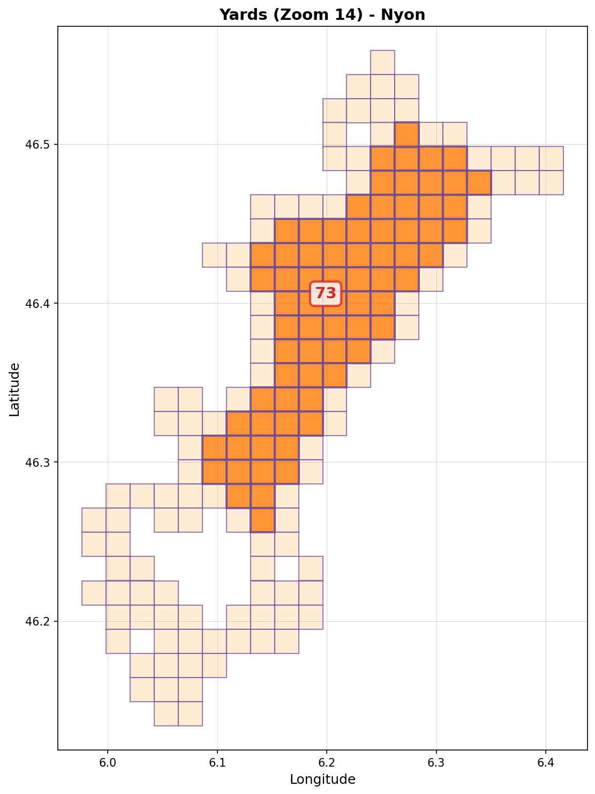
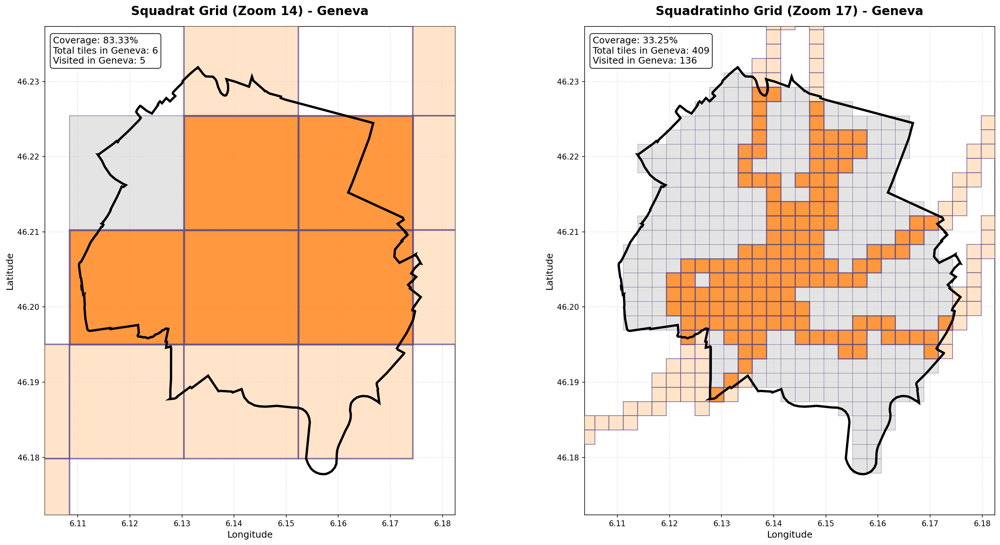

# Squadrats Local Yard Finder

Find your local "Yard" and "Yardinho" from your Squadrats data! This tool analyzes your visited squadrats (from [squadrats.com](https://squadrats.com)) and identifies secondary Yards. This is useful if you have multiple well-explored regions and want the Yard statistics displayed for them.

## What is a Yard?

A **Yard** is a connected region of squadrats where each square has all 4 neighbors (North, East, South, West) visited.
- **Yard** (Zoom 14): Your yard at the regular squadrat level
- **Yardinho** (Zoom 17): Your yard at the finer squadratinho level

## Example Results

<p align="center">
  
  
</p>
Main local Yard of 71 squares and main local Yardinho of 236 squares with 9 secondary yards identified.


Compute the coverage of a selected region. Here Geneva alone.

## Requirements

```bash
pip install pandas matplotlib numpy
```

## Usage

### 1. Download Your Squadrats Data

1. Go to [squadrats.com](https://squadrats.com)
2. Download your visited squares as a KML file `squadrats-YYYY-MM-DD.kml`

### 2. Run the Analysis with Jupyter notebook
```bash
Find_lonlat.ipynb
```
- Change the path to your .kml file  
- Map it and find a lon,lat bounded box to explore 

```bash
Local_extract.ipynb
```
- Change the path to your .kml file  
- Change the lon,lat bounded box you want to explore in Local_extract.ipynb  
- name your region `REGION`

```bash
Local_yard.ipynb
```
- Select the region you want to explore in Local_yard.ipynb  

```bash
geo_filtering.ipynb
```
- To compute the coverage of a geographical region inside the bounded box. Only done for Switzerland here.

### 3. View Results

The script will create:

- **Console output**: Summary of all yards found
- **Visualizations**: PNG images showing your yards (saved in `figure/` directory)
  - `squadrat_yards_visualization.png` - Zoom 14 yard map
  - `squadratinho_yards_visualization.png` - Zoom 17 yard map
- **Statistics**: JSON files with yard details (saved in `output/` directory)
- **Tile lists**: CSV files with coordinates of each yard (saved in `output/` directory)


### Minimum Yard Size

By default, only yards with **10 or more squares** are reported. You can adjust this threshold in the code by modifying the `MIN_YARD_SIZE` variable.

## How It Works

1. **Parse KML**: Extracts visited squadrat polygons from your KML file
2. **Create Grid**: Maps all visited squares to tile coordinates at two zoom levels
3. **Find Complete Squares**: Identifies squares where all 4 neighbors are visited
4. **Connect Components**: Groups adjacent complete squares into yards
5. **Visualize**: Creates maps showing your yards overlaid on all visited squares

## Contributing

Feel free to fork, modify, and improve! Some ideas for enhancements:
- Interactive maps with folium or leaflet
- Historical yard size tracking
- Export yards as KML for visualization in Google Earth

## Credits

Based on data from [Squadrats](https://squadrats.com) - A game about exploring the world, one square at a time.
